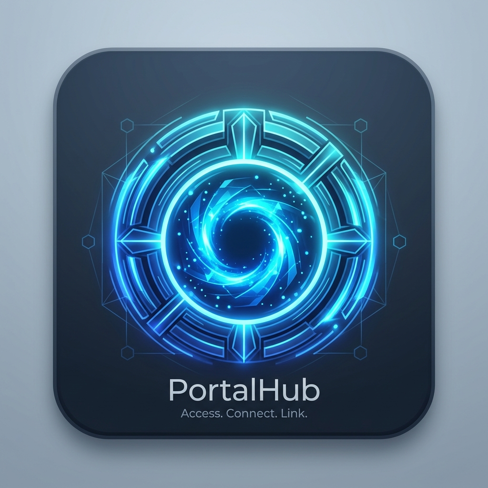

# PortalHub

<div align="center">
  
  <h3>Unified Service Gateway & Family Portfolio Hub</h3>
  <p>Dual-stack IPv4/IPv6 intranet launcher with Google Authentication, Access-Gated Admin Approval, and PWA Mobile Support.</p>
</div>

---

## Features

- **Google Authentication & Access Control**:
  - Direct integration with Google Identity Services (`g_id_signin`).
  - **Super Administrator**: `felixpareja.pmdit07@gmail.com` enjoys instant access and family approval authority.
  - **Access-Gated Family Approval Flow**: Non-admin sign-ins generate an access request awaiting admin verification.
  - **Admin Access Requests Modal**: Approve or decline family member sign-up requests, view processed statuses, and pre-approve members with 1 click.
- **Unified Service Launcher**:
  - Launch internal web applications (e.g. [Ipon PSE Portfolio](https://ipon-pse-portfolio.web.app/)) in fullscreen iframe mode.
  - Sticky top-right floating navigation bar with app switcher drawer, popout, and reload capabilities.
  - Flexible **Grid View** (<i class="fa-solid fa-table-cells-large"></i>) and **Table View** (<i class="fa-solid fa-table-list"></i>) toggling.
- **PWA & Mobile Ready**:
  - Full Apple mobile web app capability (`apple-mobile-web-app-capable: yes`, `black-translucent` status bar).
  - High-resolution `apple-touch-icon.png` and `manifest.json` for home screen install.
- **Dual-Stack Local Gateway**:
  - Python multithreaded dual-stack server supporting `http://localhost:8088` (IPv6 `::1`), `http://127.0.0.1:8088` (IPv4), and LAN IPs.
  - Permissive CORS headers allowing seamless embedding of local subprojects.

---

## Quick Start

### 1. Launch via Batch File (Windows)
Double-click `start_portal.bat` or run:
```cmd
start_portal.bat
```

### 2. Launch via Python
```bash
python serve.py
```
Open your browser to:
[http://localhost:8088/Portal/index.html](http://localhost:8088/Portal/index.html)

---

## Project Structure

```
Portal/
├── index.html            # Main PortalHub application & dashboard
├── manifest.json         # Progressive Web App manifest
├── apple-touch-icon.png  # High-res PWA & Apple Touch icon
├── favicon.png           # Browser tab favicon
├── serve.py              # Multithreaded dual-stack IPv4/IPv6 server
├── start_portal.bat      # One-click Windows server launcher
└── README.md             # Documentation
```

---

## Authentication & Security

- **Primary Admin**: `felixpareja.pmdit07@gmail.com`
- **Client ID Setup**: You can enter your custom Google OAuth 2.0 Client ID in the Settings modal to enable production Google Identity Services sign-in on your custom domains.
